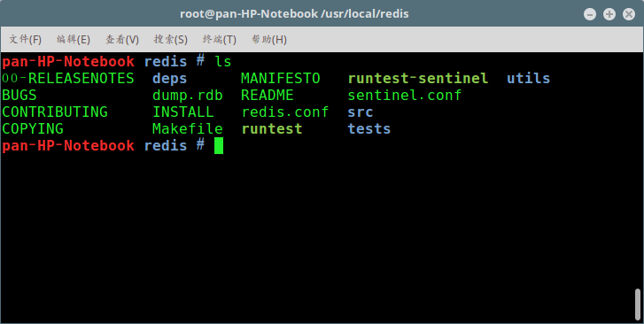

# redis的安装

## 1. 概述

在我的上一篇笔记中，介绍了**redis**的一些基本概念。在本文，我们将来安装 **redis** 的学习环境。我们将在Linux环境中安装redis服务，如果你现在没有Linux环境，可以通过这个链接参考Linux虚拟机环境的搭建方法：[使用Multipass快速创建和管理Ubuntu Server虚拟机](https://blog.jkdev.cn/index.php/archives/326/)。


本文是该系列笔记的第2篇，你可以通过下列链接阅读往期的篇章：

- [01-redis入门知识第1篇-redis简介](https://blog.jkdev.cn/index.php/archives/447/)


## 2.安装过程

可以通过以下链接去下载redis的最新源代码

[http://download.redis.io/releases/](http://download.redis.io/releases/)

在撰写这篇文章的时候，redis的最新稳定版本为`6.2.6`，所以我们这次安装6.2.6 版本，安装过程如下

```
wget http://download.redis.io/releases/redis-6.2.6.tar.gz    #下载源代码
tar xzf redis-6.2.6.tar.gz            #解压
mv redis-6.2.6 /usr/local/redis       #移动文件夹到/usr/local目录
make                                  #编译
```

使用 make 编译完成后 redis 目录下会出现编译后的 redis 服务程序 redis-server,还有用于测试的客户端程序 redis-cli,两个程序位于安装目录 src 目录下，程序主目录结构如下：


## 2.测试数据库

进入 redis 目录，执行以下命令：

    ./src/redis-server redis.conf    #参数指定配置文件

启动 redis 服务进程后，就可以使用测试客户端程序 redis-cli 和 redis 服务交互了。 如：

```
.src//redis-cli
redis> set foo bar
OK
redis> get foo
"bar"
```

## 3.关闭数据库服务

关闭命令为：redis-cli -p 端口号 shutdown，如下：

```
./src/redis-cli -p 6379 shutdown
```

## 4.修改配置文件 redis.conf

可以设置，可以不设置
（1）设置支持远程访问：
找到以下一行

```
bind 127.0.0.1
```

注释当前行即可支持远程登录

```
# bind 127.0.0.1
```

（2）默认没有密码，设置密码：
找到下面一行

```
# requirepass foobared
```

取消注释，“foobared”就是密码，可以改成其他的，如改成“myredis”

```
requirepass myredis
```

重启服务，使用 a 参数传入密码才可以正常操作

```
./src/redis-cli -a myredis
```
